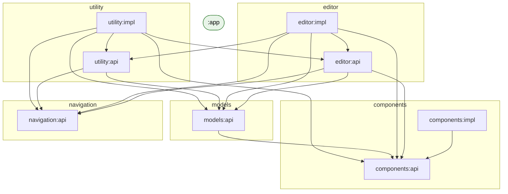

# Internal Module Graph

> **Generated — do not edit by hand.**
> Refresh with `./gradlew generateInternalModuleGraph` and commit the result.
>
> `:app` is shown as a node but its outgoing edges are hidden —
> it correctly depends on every module as the composition root.
>
> **Red edges** = architecture violation: a module outside `:app`
> depends on an `:impl` module, which must never be shared.

