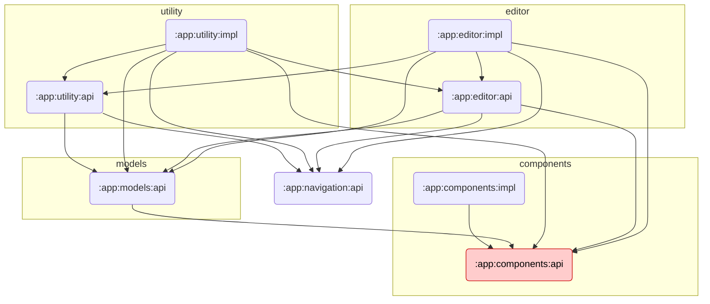

# Module Graph

## Module Dependency Diagram

> `:app` wires all modules together (DI, navigation) and depends on every module below.
> Those dependencies are all correct and omitted from the diagram for clarity.

`:app:components:api` is highlighted because it still carries a suspicious external dependency — see the table below.

---

## Per-Module Dependencies

### `:app:navigation:api`

No dependencies. Contains only the `NavigationEntry` marker interface.

---

### `:app:components:api`

| Dependency | Status | Notes |
|---|---|---|
| `androidx.core:core-ktx` | Unverified | API module contains only interfaces and field entities; no KTX extension usage found |
| `androidx.compose.ui:ui` | Required | `Modifier` parameter type in `FieldProvider` |
| `androidx.compose.runtime:runtime` | Required | `@Composable` annotation |
| `androidx.health.connect:connect-client` | Required | HC SDK types used in field definitions |
| **`kotlin("reflect")`** | **Unused** | No `kotlin.reflect.*` usage in source; reflection lives in `:app:models:api` |

---

### `:app:components:impl`

| Dependency | Status | Notes |
|---|---|---|
| `androidx.core:core-ktx` | Unverified | Worth confirming actual KTX usage |
| `:app:components:api` | Required | Implements component interfaces |
| `androidx.health.connect:connect-client` | Required | Field types that wrap HC SDK types |
| `androidx.compose.bom` | Required | Compose UI |
| `androidx.compose.material3` | Required | Material3 widgets |
| `androidx.compose.material:material-icons-core` | Required | Icons in editors |
| `androidx.lifecycle:lifecycle-viewmodel-compose` | Required | `viewModel()` in composables |
| `androidx.lifecycle:lifecycle-viewmodel-ktx` | Required | `viewModelScope` |

---

### `:app:models:api`

| Dependency | Status | Notes |
|---|---|---|
| `androidx.core:core-ktx` | Unverified | Domain model module; no KTX usage found |
| `:app:components:api` | Required | `Model` base class uses `Field` and `MetadataField` |
| `kotlin("reflect")` | Required | `Model.getFields()` calls `KClass.declaredMemberProperties` |

---

### `:app:utility:api`

| Dependency | Status | Notes |
|---|---|---|
| `androidx.core:core-ktx` | Unverified | Interface-only module; no KTX usage found |
| `:app:navigation:api` | Required | `NavigationEntry` base type in provider interface |
| `:app:models:api` | Required | `Model` in `UtilityNavigationEntry.Records` |
| `androidx.health.connect:connect-client` | Required | `Record` in `Payload.ReadList<T : Record>` |
| `androidx.compose.runtime:runtime` | Required | `SnapshotStateList` in provider interface |
| `androidx.compose.foundation:foundation-layout` | Required | `PaddingValues` in provider interface |
| `androidx.navigation3:navigation3-runtime` | Required | `NavEntry` return type |

---

### `:app:utility:impl`

| Dependency | Status | Notes |
|---|---|---|
| `androidx.core:core-ktx` | Unverified | Worth confirming actual KTX usage |
| `:app:utility:api` | Required | Implements `UtilityNavigationEntryProvider` and use cases |
| `:app:editor:api` | Required | Pushes `EditorNavigationEntry` entries onto the back-stack |
| `:app:navigation:api` | Required | `UtilityNavigationEntryProviderImpl` directly imports `NavigationEntry` |
| `:app:components:api` | Required | Field types used in record summary composables |
| `:app:models:api` | Required | Domain model types throughout |
| `androidx.health.connect:connect-client` | Required | Direct HC SDK calls in repository |
| `androidx.compose.bom` | Required | Compose UI |
| `androidx.compose.material3` | Required | Material3 |
| `androidx.compose.material:material-icons-extended` | Required | Extended icon set |
| `androidx.lifecycle:lifecycle-viewmodel-compose` | Required | ViewModels |
| `androidx.lifecycle:lifecycle-viewmodel-ktx` | Required | `viewModelScope` |
| `androidx.navigation3:navigation3-runtime` | Required | Back-stack operations |
| `androidx.compose.material3.adaptive:adaptive-navigation3` | Required | Adaptive layout |

---

### `:app:editor:api`

| Dependency | Status | Notes |
|---|---|---|
| `androidx.core:core-ktx` | Unverified | Interface-only module; no KTX usage found |
| `:app:components:api` | Required | `Field` in `FieldModificationEvent` |
| `:app:navigation:api` | Required | `NavigationEntry` base type |
| `:app:models:api` | Required | `Model` in navigation entries and `ModelFactory` |
| `androidx.health.connect:connect-client` | Required | `Record` in `ModelFactory` interface |
| `androidx.compose.foundation:foundation-layout` | Required | `PaddingValues` in provider interface |
| `androidx.navigation3:navigation3-runtime` | Required | `NavEntry` return type |

---

### `:app:editor:impl`

| Dependency | Status | Notes |
|---|---|---|
| `androidx.core:core-ktx` | Unverified | Worth confirming actual KTX usage |
| `:app:components:api` | Required | Field types used throughout editor screens |
| `:app:utility:api` | Required | `Insert` and `Update` use cases |
| `:app:editor:api` | Required | Implements editor interfaces and `ModelFactory` |
| `:app:navigation:api` | Required | `EditorNavigationEntryProviderImpl` directly imports `NavigationEntry` |
| `:app:models:api` | Required | Domain models being edited |
| `kotlin("reflect")` | Required | Used to build field lists from `Model` subclasses at runtime |
| `androidx.compose.bom` | Required | Compose UI |
| `androidx.compose.material3` | Required | Material3 |
| `androidx.lifecycle:lifecycle-viewmodel-compose` | Required | ViewModels |
| `androidx.lifecycle:lifecycle-viewmodel-ktx` | Required | `viewModelScope` |
| `androidx.health.connect:connect-client` | Required | HC SDK types in mappers |
| `androidx.navigation3:navigation3-runtime` | Required | Navigation |

---

### `:app` (application module)

Internal module dependencies are all correct (omitted). Third-party dependencies:

| Dependency | Status | Notes |
|---|---|---|
| `androidx.core:core-ktx` | Required | Activity/context extensions in `MainActivity` |
| `androidx.lifecycle:lifecycle-runtime-ktx` | Required | Lifecycle-aware coroutines |
| `androidx.activity:activity-compose` | Required | `setContent {}` |
| `androidx.compose.bom` + UI / Material3 | Required | Core Compose UI |
| `androidx.health.connect:connect-client` | Required | `HealthConnectClient` in `MainActivity` |
| `androidx.lifecycle:lifecycle-viewmodel-*` | Required | `ActivityViewModel` |
| `androidx.navigation3:navigation3-*` | Required | `NavDisplay`, back-stack |
| `androidx.compose.material3.adaptive:adaptive-navigation3` | Required | Adaptive layout |
| `kotlinx.serialization.core` | Required | Serialization plugin support |
| `libs.core.ktx` (`androidx.test:core-ktx`) | `testImplementation` ✓ | Correctly scoped after fix |

---

## Open Issues

| Severity | Module | Dependency | Problem |
|---|---|---|---|
| Medium | `:app:components:api` | `kotlin("reflect")` | No reflection calls in source; reflection is in `:app:models:api` |
| Low | Multiple API modules | `androidx.core:core-ktx` | No KTX extension imports found in interface/entity-only modules (`components:api`, `models:api`, `utility:api`, `editor:api`) |
