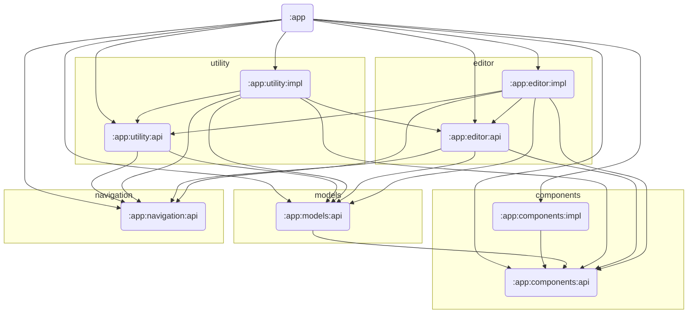

# Module Graph

## Module Dependency Diagram

**Rule:** `impl` modules depend on their own `api` and may depend on other `api` modules.
Circular dependencies are forbidden. `:app` is the only module that wires `api` + `impl` pairs together.

---

## Per-Module Dependencies

### `:app:navigation:api`

No dependencies. Contains only the `NavigationEntry` marker interface.

---

### `:app:components:api`

| Dependency | Status | Notes |
|---|---|---|
| `androidx.core:core-ktx` | **Unused** | No KTX extensions called anywhere in this module |
| `androidx.appcompat:appcompat` | **Unused** | Compose-only module; no AppCompat views or activities |
| `com.google.android.material:material` | **Unused** | View-based library; module uses Compose |
| `androidx.compose.foundation:foundation` | **Unused** | No `foundation.*` imports found; only `compose.runtime` is needed for `@Composable` |
| `androidx.health.connect:connect-client` | Required | Health Connect SDK types used in field definitions |
| `androidx.compose.runtime:runtime` | Required | `@Composable`, `Modifier` |
| `kotlin("reflect")` | **Unused** | No `kotlin.reflect.*` usage found in source |

---

### `:app:components:impl`

| Dependency | Status | Notes |
|---|---|---|
| `androidx.core:core-ktx` | Unverified | No explicit KTX import found; likely unused |
| `androidx.appcompat:appcompat` | **Unused** | Compose-only module |
| `com.google.android.material:material` | **Unused** | View-based library |
| `:app:components:api` | Required | Implements component interfaces |
| `androidx.health.connect:connect-client` | Unverified | May be needed for field types that wrap HC types |
| `androidx.compose.bom` | Required | Compose UI |
| `androidx.compose.material3` | Required | Material3 widgets |
| `androidx.compose.material:material-icons-core` | Required | Icons in editors |
| `androidx.lifecycle:lifecycle-viewmodel-compose` | Required | `viewModel()` composable |
| `androidx.lifecycle:lifecycle-viewmodel-ktx` | Required | `viewModelScope` |

---

### `:app:models:api`

| Dependency | Status | Notes |
|---|---|---|
| `androidx.core:core-ktx` | **Unused** | No KTX extensions in pure domain model code |
| `androidx.appcompat:appcompat` | **Unused** | Compose-only module |
| `com.google.android.material:material` | **Unused** | View-based library |
| `:app:components:api` | Required | `Model` extends `Field`/`MetadataField` from components |
| `kotlin("reflect")` | Required | `Model.getFields()` uses `KClass.declaredMemberProperties` |

---

### `:app:utility:api`

| Dependency | Status | Notes |
|---|---|---|
| `androidx.core:core-ktx` | **Unused** | No KTX extensions in interface/entity code |
| `androidx.appcompat:appcompat` | **Unused** | Compose-only module |
| `com.google.android.material:material` | **Unused** | View-based library |
| `:app:navigation:api` | Required | `NavigationEntry` base type used in provider interface |
| `:app:models:api` | Required | `Model` referenced in navigation entries |
| `androidx.health.connect:connect-client` | Required | `Record` used in `Payload.ReadList<T : Record>` |
| `androidx.compose.foundation:foundation-layout` | Required | `PaddingValues` in `UtilityNavigationEntryProvider` |
| `androidx.navigation3:navigation3-runtime` | Required | `NavEntry` return type in provider interface |

> **Note:** `UtilityNavigationEntryProvider` uses `SnapshotStateList<NavigationEntry>` from `compose.runtime`,
> but `compose.runtime` is not explicitly declared — it arrives transitively through `foundation-layout`.
> Consider adding an explicit `androidx.compose.runtime:runtime` dependency.

---

### `:app:utility:impl`

| Dependency | Status | Notes |
|---|---|---|
| `androidx.core:core-ktx` | Unverified | Worth confirming actual usage |
| `androidx.appcompat:appcompat` | **Unused** | Compose-only module |
| `com.google.android.material:material` | **Unused** | View-based library |
| `:app:utility:api` | Required | Implements utility interfaces |
| `:app:editor:api` | Required | `ModelFactory`, `EditorNavigationEntry` |
| `:app:navigation:api` | Possibly redundant | `NavigationEntry` is used transitively via `utility:api`; needed only if impl code directly references the type |
| `:app:components:api` | Required | Field types used in UI rendering |
| `:app:models:api` | Required | Record model types |
| `androidx.health.connect:connect-client` | Required | Direct HC SDK calls |
| `androidx.compose.bom` | Required | Compose UI |
| `androidx.compose.material3` | Required | Material3 |
| `androidx.compose.material:material-icons-extended` | Required | Extended icon set |
| `androidx.lifecycle:lifecycle-viewmodel-compose` | Required | ViewModels in composables |
| `androidx.lifecycle:lifecycle-viewmodel-ktx` | Required | `viewModelScope` |
| `androidx.navigation3:navigation3-runtime` | Required | Navigation back-stack |
| `androidx.compose.material3.adaptive:adaptive-navigation3` | Required | Adaptive layout |

---

### `:app:editor:api`

| Dependency | Status | Notes |
|---|---|---|
| `androidx.core:core-ktx` | **Unused** | No KTX extensions in interface/entry code |
| `androidx.appcompat:appcompat` | **Unused** | Compose-only module |
| `com.google.android.material:material` | **Unused** | View-based library |
| `:app:components:api` | Required | `Field` type in `FieldModificationEvent` |
| `:app:navigation:api` | Required | `NavigationEntry` base type |
| `:app:models:api` | Required | `Model` in navigation entries and `ModelFactory` |
| `androidx.health.connect:connect-client` | Required | `Record` in `ModelFactory` interface |
| `androidx.compose.foundation:foundation-layout` | Required | `PaddingValues` in `EditorNavigationEntryProvider` |
| `androidx.navigation3:navigation3-runtime` | Required | `NavEntry` return type |
| `kotlin("reflect")` | **Likely unused** | Only `KClass<out Model>` is used as a type; `KClass` is in stdlib and does not require the `kotlin-reflect` artifact |

---

### `:app:editor:impl`

| Dependency | Status | Notes |
|---|---|---|
| `androidx.core:core-ktx` | Unverified | Worth confirming actual usage |
| `androidx.appcompat:appcompat` | **Unused** | Compose-only module |
| `com.google.android.material:material` | **Unused** | View-based library |
| `:app:components:api` | Required | Field types used in editor screens |
| `:app:utility:api` | Required | Use cases (`Insert`, `Update`) |
| `:app:editor:api` | Required | Implements editor interfaces |
| `:app:navigation:api` | Possibly redundant | `NavigationEntry` is needed for back-stack manipulation; verify direct import |
| `:app:models:api` | Required | Domain models being edited |
| `kotlin("reflect")` | Required | Editor uses reflection to build field lists from `Model` subclasses |
| `androidx.compose.bom` | Required | Compose UI |
| `androidx.compose.material3` | Required | Material3 |
| `androidx.lifecycle:lifecycle-viewmodel-compose` | Required | ViewModels |
| `androidx.lifecycle:lifecycle-viewmodel-ktx` | Required | `viewModelScope` |
| `androidx.health.connect:connect-client` | Required | HC SDK types in mappers |
| `androidx.navigation3:navigation3-runtime` | Required | Navigation |

---

### `:app` (application module)

| Dependency | Status | Notes |
|---|---|---|
| `androidx.core:core-ktx` | Required | Activity/context extensions |
| `androidx.lifecycle:lifecycle-runtime-ktx` | Required | Lifecycle-aware coroutines |
| `androidx.activity:activity-compose` | Required | `setContent {}` |
| `androidx.compose.bom` | Required | Compose BOM |
| `androidx.ui` / `androidx.ui.graphics` / `androidx.ui.tooling.preview` | Required | Core Compose UI |
| `androidx.compose.material3` | Required | Material3 |
| `androidx.health.connect:connect-client` | Required | `HealthConnectClient` in `MainActivity` |
| All `:app:*` submodules | Required | DI wiring happens here |
| `androidx.lifecycle:lifecycle-viewmodel-compose` | Required | `ActivityViewModel` |
| `androidx.lifecycle:lifecycle-viewmodel-ktx` | Required | `viewModelScope` |
| `androidx.navigation3:navigation3-ui` | Required | `NavDisplay` |
| `androidx.navigation3:navigation3-runtime` | Required | Back-stack |
| `androidx.lifecycle:lifecycle-viewmodel-navigation3` | Required | ViewModel-aware nav |
| `androidx.compose.material3.adaptive:adaptive-navigation3` | Required | Adaptive layout |
| `kotlinx.serialization.core` | Required | Serialization plugin support |
| **`libs.core.ktx` (`androidx.test:core-ktx`)** | **Wrong scope** | This is `androidx.test:core-ktx:1.7.0`, a test artifact. Declared as `implementation` but must be `testImplementation`. Different from `libs.androidx.core.ktx` (`androidx.core:core-ktx`). |

---

## Summary of Issues

| Severity | Module | Dependency | Problem |
|---|---|---|---|
| High | `:app` | `libs.core.ktx` (`androidx.test:core-ktx`) | Test artifact declared as `implementation`; must be `testImplementation` |
| Medium | All library modules | `androidx.appcompat:appcompat` | Unused in every module; this is a Compose-first project |
| Medium | All library modules | `com.google.android.material:material` | Unused in every module; View-based library |
| Medium | `:app:components:api` | `androidx.compose.foundation:foundation` | No foundation imports; `compose.runtime` is the only needed Compose dep |
| Low | `:app:components:api` | `kotlin("reflect")` | No reflection usage in source |
| Low | `:app:editor:api` | `kotlin("reflect")` | `KClass` as a type only; stdlib is sufficient |
| Low | `:app:utility:api` | *(missing)* `androidx.compose.runtime:runtime` | `SnapshotStateList` is used but runtime is implicit via transitive dep |
